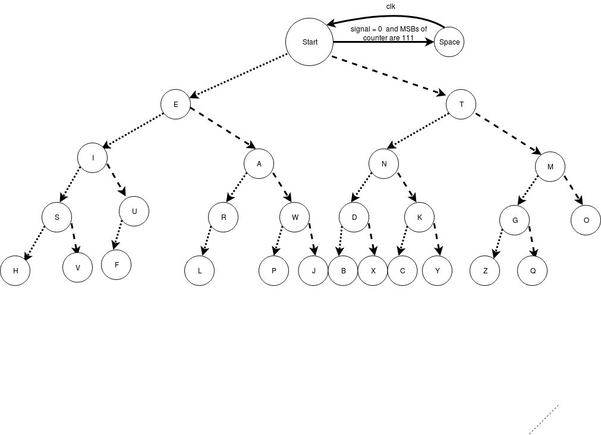

# Technology

We separated the Morse Decoder into three distinct parts. The first part decodes the signal into a series of dits, dahs, gaps, and spaces. The second part takes those and outputs the letters as well as a done flag. The last part implements the former parts on the FPGA.

## Signal into Dits and Dahs

First, we have a synchronizer comprised of two d-flip-flops to synchronize the signal to the clock of the system. To implement the signal decoder, we made a counter that starts counting up as long as the signal is constant, whether high or low. The counter increments by one for each clock cycle. When the signal switches, the counter is reset to 0. This counter serves as a debouncer of the button as well as timing for the dits, dahs, gaps and spaces. The following table details what constitutes a dit dah, gap and space:

| Output |  Time Length (Relative) | Held Signal  | MSBs |
|--------|-------------------------|--------------|------|
| Dit    |         1               |      1       | 001  |
| Dah    |         3               |      1       | 011  |
| Gap    |         3               |      0       | 011  |
| Space  |         7               |      0       | 111  |

Dits and Dahs are activated when the signal goes from on to off, depending on the value of the counter. If the three most significant bits (MSB) are 001, a dit is output for one clock cycle. if the three most signifcant bits are 011, a dah is output for one clock cycle. Because a space is technically a space, gap needs to be output in addition to a space being output. So gap is output as soon as the most significant bits are 011, and all other bits are 0, so that it is still for only one clock cycle. A space is output when the signal goes from off to on, and the most significant bits are 111. Checking the three most significant bits gives the user a window of one time length (same as the length of a dit), as users are not perfect. For our implementation on the FPGA, the clock is running at 120MHz, and we decided upon 28 bits for the counter, causing the time length to be about one second.

## Translating Dits, Dahs, Spaces, and Gaps Into Letters

Alphabet FSM takes in the dits, dahs, spaces, and gaps produced by the module in `DitDahDecoder.v` and translates a series of these signals to letters for the system to output. This finite state machine is in the `alphabetMachine.v` file in the project repository.

A slightly simplified version of the implemented finite state machine is shown above is shown above

## Wrapper for FPGA

The FPGA implementation of the Vivado simulation required a wrapper to synthesize on the FPGA we used for the project (the Zybo Zynq-7000). Once the Vivado implementation was completed, we wrote morse_wrapper.v to include the MorseDecoder.v file that managed the signals and states in combination with a register module file. The wrapper file consists of a singular module that takes the clock and button presses as inputs, and outputs various information on the board LEDs, as well as a peripheral module that has an 8-LED package. The inputs and outputs of the MorseDecoder module were wired up, and the input signal was assigned to a button on the FPGA. After this signal was received on the hardware, we ran it through two D-flip-flops to synchronize it with the clock, and then passed it as an input to the MorseDecoder module. The outputs of this module, done and letter, were assigned to various LEDs on the FPGA and peripheral board, listed below in the table.

|   Hardware   |  Information Displayed  | <!--thanks nathan-->
|--------------|-------------------------|
| Button 0     |        User Input       |
| LED 0        |      MSB of Counter     |
| LED 1        |    3rd MSB of Counter   |
| LED 2        |        Done Flag        |
| LED 2        | Output 1st Synchronizer |
| PMOD LED 0-7 |   ASCII Code of Letter  |
